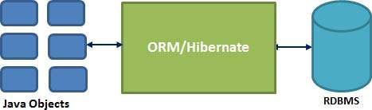

# Object Relational Mapping (ORM) with Hibernate Database Connector
Hibernate works as an interface between the java object of our project 
and a database (via a external database connector). It provides the functionality to save 
the native java objects into the database, generates the tables, writes entities and cares for the relations
between objects. We don't have to write a single line of SQL-Code to interact with the database
although we don't lose any kind of possibilities for interaction.  
  
## Setup
Install the external packages either from the __.jar__ files or use a project manager for that
### Install all components
#### Download jar
We can download the __.zip__ or __.tz__ from [here](http://hibernate.org/orm/releases/)  
Then extract all the files in the `/lib` folder as well as the ```hibernateXX.jar``` to our projects ```CLASSPATH```

#### Maven
Include the following dependency in our pom.xml
```xml
<dependency>
    <groupId>org.hibernate</groupId>
    <artifactId>hibernate-agroal</artifactId>
    <version>5.3.14.Final</version>
    <type>pom</type>
</dependency>
```

#### Additional Database Connector
Depending on your Database, we also have to download the correct Database connector as well.

### Configuration
#### Hibernate Database connection
To allow Hibernate to connect to the database, we have to tell the program how and where to connect. 
This is done by the ```hibernate.cfg.xml``` file. Look into [hibernate.cfg.xml](./src/main/resources/hibernate.cfg.xml) 
to see an example.
#### Object Mappings
One way to bind the object mappings of the java objects to the corresponding database fields, 
is to configure the bindings in xml mapping files, that are referenced from the ```hibernate.cfg.xml``` like this:  
```xml
<mapping resource = "Student.hbm.xml"/>
```
An example for a mapping file can be found [here](./src/main/resources/Student.hbm.xml)  
  
*The other way of adding the bindings is to use annotations directly in the java code*

## Basic Usage
### Provide Object Mapping
#### As external XML File
Reference a external xml file, containing the bindings, in the ```hibernate.cfg.xml``` as described in *Object Mappings* 
Most important tags:
- ```<hibernate-mapping>``` is the root tag, surrounding all hibernate mapping definitions
- ```class``` maps a Java Class to a database table. Contains different tags to describe the single columns 
matching to various attributes
- ```<id>``` marks the key attribute/column
- ```<property>``` describes a standard table column's mapping to a Java attribute
- ```<set>``` defines a relation between multiple tables   
- ```generator``` marks any attribute as autogenerated by the database
- ```meta``` adds additional information, e.g. a table description    
[Example File](./src/main/resources/Student.hbm.xml)
#### As Annotation in Java Code
Add the mappings as annotations directly into your Java source code.  
Annotations for object attributes:
- ```@Entity``` starts a new entity definition
- ```@Table``` maps a Java Class to a database table
- ```@Id``` marks the key attribute/column
- ```@Column``` describes a standard table column's mapping to a Java attribute
- ```@GeneratedValue``` marks any attribute as autogenerated by the database
- ```@OneToMany```/```@OneToOne```/```@ManyToOne```/```@ManyToMany``` defines relations between different classes  
[Example File](./src/main/java/dhbw/se/hibernate/demo/Student.java)

### Workflow
As everything in this tutorial is just an overview of the very basic functionality. For more details look into the 
[javadoc of Hibernate](https://docs.jboss.org/hibernate/orm/5.4/javadocs/)
#### SessionFactory
The ```SessionFactory``` works as a factory object to create sessions to the database in our project. 
It's thread save and can be used by all threads of the application. 
We can create it from a ```Configuration``` object, which contains the information 
about the database connection from ```hibernate.cfg.xml``` and the mappings from either then xml-file 
or the java Annotations.
```java
Configuration configuration = new Configuration().configure("hibernate.cfg.xml");
//Add further attributes to the configuration e.g.: annotated class
configuration.addAnnotatedClass(Student.class);
SessionFactory factory = configuration.buildSessionFactory();
```

#### Session
A ```Session``` represents the *physical* connection to the database. It should be instantiated 
each time we need it as it is not thread safe and therefore should not be keep open for too long.
```java
Session session = factory.openSession();
//Interact with the database
session.close();
```

#### Transaction
Transactions are an optional object and not required for a database interaction but most of 
the databases support this functionality and therefore hibernate supports it as well.
```java
tx = session.beginTransaction();
//Do querys etc.
tx.commit();
```

#### CRUD Operations
```java
tx = session.beginTransaction();
Student me = new Student("Moritz", new SimpleDateFormat("dd/MM/yyyy").parse("01/01/2001"));
int StudentID = (Integer) session.save(me); // Add student element
//session.saveOrUpdate(student); to save if entry does not exist, otherwise update it 
Student student = (Student)session.get(Student.class, StudentID); // Get student entry
student.setName("Max");
session.update(student); // Update student entry
session.delete(student); //Delete student entry
tx.commit();
```
Session methods for CRUD operations:
 - ```save()``` Saves the given object and returns the database output (in most cases the id)
 - ```get()``` Queries for a key value and returns the result as an object of the given class
 - ```delete()``` Removes the object's representation in the database
 - ```update()``` Updates the values in the database with the attributes of the object 
 - ```saveOrUpdate()``` Either saves the object, if it is not yet saved in the database, or updates an already present representation
#### Further Operations - Query
For further or more complex queries, hibernates provides a SQL Dialect *Hibernate Query Language* (HQL) for 
querying the database. One option is to write it as plain text query, similar to SQL.
```java
String hql = "FROM Student S WHERE S.id > 2 ORDER BY S.birthdate ASC";
Query query = session.createQuery(hql);
List results = query.list();
```
Another option is to generate a query (now called Criteria) by multiple method calls.
```java
Criteria cr = session.createCriteria(Student.class);
cr.add(Restrictions.gt("id", 2));
cr.addOrder(Order.asc("birthdate"));
cr.list();
```
As a third option it is also possible to execute SQL statements. __BUT__ the response is not wrapped into an object.
```java
Query query = session.createSQLQuery("SELECT * FROM Student WHERE id > 2 ORDER BY birthdate ASC");
List<Object[]> rows = query.list();
```
## Further Reading
[Hibernate Tutorial](https://www.tutorialspoint.com/hibernate/index.htm)  
[PostgreSQL Connector](https://jdbc.postgresql.org/)  
[Hibernate Website](https://hibernate.org/)